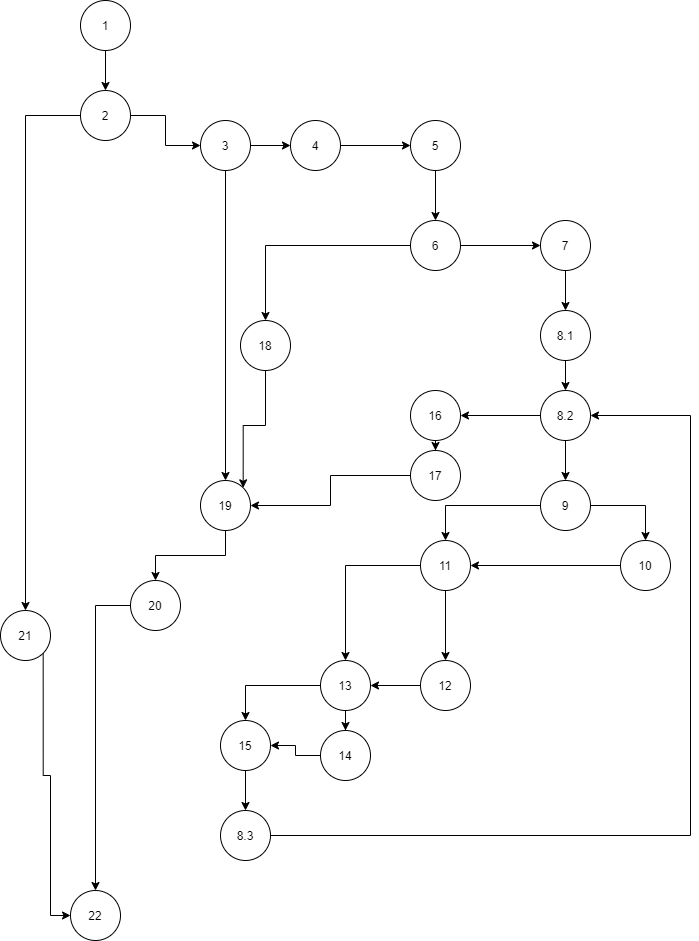

**Втора лабораториска вежба по Софтверско инженерство**

**Драган Петковски бр. на индекс 155056**

**Група на код:**

Ја добив групата на код 4

**Control Flow Graph**

**Цикломатска комплексност**

Цикломатската комплексност на овој код е 5, истата ја добив преку формулата=
E-N+2 = 5, каде Е е бројот на ребрата 27 и N е бројот на јазлите 24 па
цикломатската комплексност изнесува 5.
